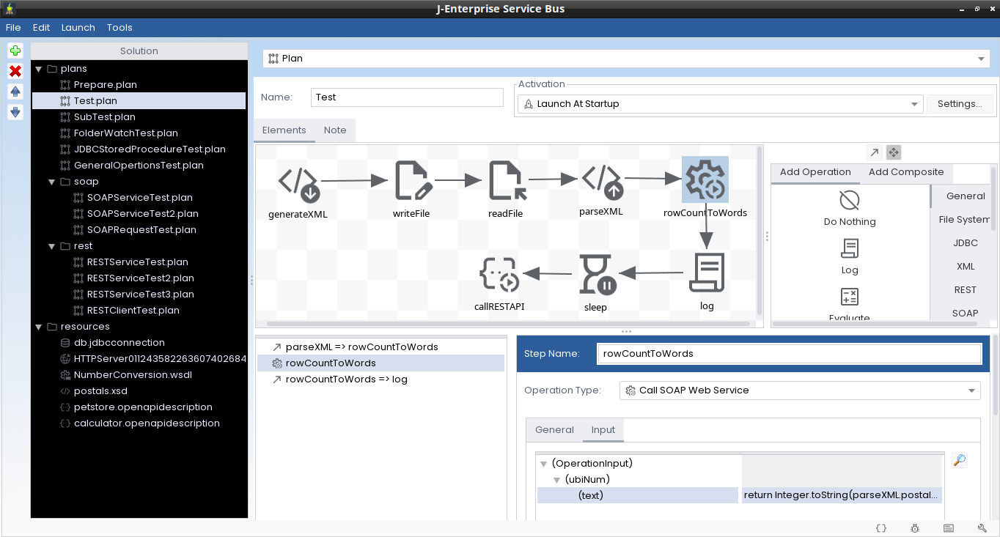

J-Enterprise Service Bus
========================

# Overview

It is a Java-based open source visual development platform allowing to automate business processes and connect heterogeneous applicative systems. 

It has a graphical user interface for process modeling and debugging. 
<table>
<tr>
<td></td>
<!--  <td></td> -->
</tr>
</table>

The dynamism/intelligence of the processes is expressed through (essentially) Java code snippets, which eliminates the need to learn any specific syntax.

Extensibility is almost a key feature allowing any user to model and mostly generate plugins complementing core features as needed.

# Screencasts

[J-Enterprise Service Bus - Hello REST API](https://youtu.be/h5h_M6LfY3E)

[J-Enterprise Service Bus - Plugin Demo](https://youtu.be/hBFH9a1__vY)

# Use Cases

- Integrating heterogeneous applications (REST/SOAP, XML, database, ...)
- Developing ETL (extract, transform, and load) / ESB (Enterprise Service Bus) jobs
- Orchestrating business processes
- …

# Advantages

- Visual process development (low code) and debugging
- Java-based expression editor (no specific language to learn)
- Simplified extensibility (plugins generator available)
- Easy reusability/integration (Maven dependency available)

# Compatibility

Tested on Windows & Linux.

# Licensing

It is distributed under this
[license](https://github.com/dotxyteam/JEnterpriseServiceBus/blob/master/j-enterprise-service-bus/LICENSE).

# Download

*  [Get the source code and the binaries↓](https://github.com/dotxyteam/JEnterpriseServiceBus/releases)

# Getting started

*   Get the archives from the download area (see above)
    *   Choose the one corresponding to your OS
    *   Extract it
*   Run the executable (with "--help" command-line argument to see available options).
    *   NOTE: On Windows you must run the CMD executable (**j-enterprise-service-bus-cmd.exe**) if you intend to use the command-line options.

# Documentation

Explore the [Wiki](https://github.com/dotxyteam/JEnterpriseServiceBus/wiki) to learn more.

# Support

The support page is hosted [here on GitHub](https://github.com/dotxyteam/JEnterpriseServiceBus/issues). You can also contact us by email: [dotxyteam@yahoo.fr](mailto:dotxyteam@yahoo.fr).
